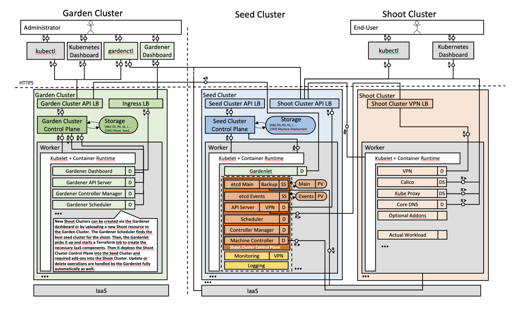

# [#Gardener](https://gardener.cloud) 's logging stack is moving to [#Loki](https://grafana.com/oss/loki)

## About [Gardener](https://gardener.cloud/)
Gardener delivers fully managed Kubernetes clusters as a service and provides a fully validated extensibility framework that can be adjusted to any programmatic cloud or infrastructure provider.

Gardener's main principle is to **leverage Kubernetes concepts for all of its tasks**.

In essence, Gardener is an [extension API server](https://kubernetes.io/docs/tasks/access-kubernetes-api/setup-extension-api-server) that comes along with a bundle of custom controllers. It introduces new API objects in an existing Kubernetes cluster (which is called **garden** cluster) in order to use them for the management of end-user Kubernetes clusters (which are called (off-)**shoot** clusters). These shoot clusters are described via [declarative cluster specifications](https://github.com/gardener/gardener/blob/master/example/90-shoot.yaml) which are observed by the controllers and their control planes are hosted on dedicated **seed** clusters. They will bring up the clusters, reconcile their state, perform automated updates and make sure they are always up and running.

## Motivation behind the integration of Loki
As of today [#Gardener](https://gardener.cloud/) manages thousands of Kubernetes clusters SAP and the demand is still growing inside and outside. [#Gardener](https://gardener.cloud) clusters come with a monitoring and logging stack for the control planes of these clusters. While the monitoring stack is straight-forward, the logging stack was more of a challenge as it had to come with these requirements:
1) Resource efficient (cpu, memory)
2) Secure and reliable
3) Multi-tenant (per cluster)
4) Dynamic vertical scaling

## What we had until now

#### Limitations
1) Two middle layer components ([fluentd](https://www.fluentd.org/) and [elastic-search](https://www.elastic.co/elasticsearch/)) which make it difficult to trace an issue.
2) Elastic-search is a heavyweight Java application where the dynamic vertical scaling is really hard.
3) Using [Grafana](https://grafana.com/) as monitoring UI and [Kibana](https://www.elastic.co/kibana) as logging UI is not optimal from usability point of view.

## Gardener's new logging stack architecture

#### Improvements
1) Getting rid of [fluentd](https://www.fluentd.org/). It is replaced by [fluent-bit](https://fluentbit.io) and a Golang plugin which dynamically serves the log messages to the right `Loki` instance.
2) It is really easy to scale `Loki` vertically.
3) One harmonized monitoring and logging UI (`Grafana`), so that the metrics and the logs are in one place.
4) Requiring a lot of less resources (cpu, memory) compared to the previous (EFFK) stack.
